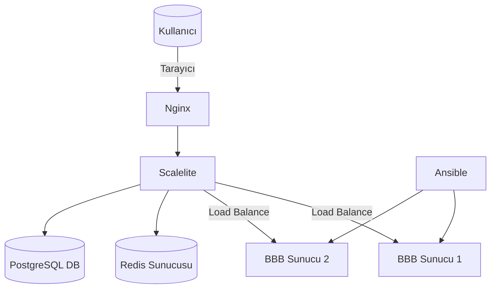

# Scalelite-Ansible-BBB
scalelite ile Bigbluebutton organizasyonu ve  ansible ile temel yapılandırma ölçeklendirme
# Scalelite ile BigBlueButton Organizasyonu ve Ansible ile Yapılandırma & Ölçeklendirme


## 🔍 Proje Özeti
Bu projede, açık kaynak video konferans sistemi BigBlueButton (BBB), birden fazla sunucuda dağıtık bir şekilde kurularak Scalelite ile yönetilmiş ve Ansible kullanılarak yapılandırma süreçleri otomatize edilmiştir.
📄 [BBB Proje Raporunu PDF olarak görüntüle](./SCALELİTE_İLE_BİGBLUEBUTTON_ORGANİZASYONU_VE_ANSİBLE_İLE_TEMEL_YAPILANDIRMA_ÖLÇEKLENDİRME.pdf)
## 🧱 Big Picture
Aşağıdaki diyagram, tüm bileşenlerin birbirleriyle olan bağlantısını özetler:



> Yukarıdaki mimari, Scalelite’in gelen bağlantıları BBB sunucularına dağıtmasını ve Ansible’ın yapılandırma işlevini nasıl gerçekleştirdiğini göstermektedir.

## 📁 Proje Yapısı
```
.
├── README.md
├── big_picture.png
├── architecture.md
├── ansible/
│   ├── inventory/
│   ├── roles/
│   └── playbook.yml
├── bbb_servers/
│   ├── bbb1-conf-check.txt
│   ├── bbb2-conf-check.txt
│   └── ekran_goruntuleri/
├── scalelite/
│   ├── scalelite_status.txt
│   └── scalelite-ui.png
├── docs/
│   ├── kurulum_adimlari.md
│   ├── sorunlar_ve_cozumler.md
│   └── test_senaryolari.md
```

## ⚙️ Kullanılan Teknolojiler
- Ubuntu 22.04
- BigBlueButton 3.0
- Scalelite (Docker tabanlı)
- Ansible
- Redis, PostgreSQL

## 🚀 Kurulum Adımları
Ayrıntılı kurulum adımlarına `docs/kurulum_adimlari.md` içinden ulaşabilirsiniz.

### Özetle:
1. VirtualBox üzerinde 2 adet BBB sunucusu oluşturuldu.
2. Ansible ile yapılandırma otomasyonu sağlandı.
3. Scalelite kurulumu gerçekleştirildi.
4. BBB sunucuları Scalelite’e kayıt edildi.
5. Başarılı kurulum sonrası yük dengeleme testleri yapıldı.

## 🧪 Çıktılar
- `bbb-conf --check` çıktıları (BBB sunucularının durumu)
- `scalelite_status.txt` (Scalelite container’larının durumu)
- Test bağlantı ekran görüntüleri


## ⚠️ Gizlilik
Görsellerde veya log dosyalarında yer alan **TC Kimlik No**, **kullanıcı adı** veya **kişisel veriler** silinmiş/sansürlenmiştir.


---

🛠 Yardıma ihtiyacınız olursa `docs/sorunlar_ve_cozumler.md` içinde karşılaşılan teknik zorluklar ve çözümleri yer almaktadır.
